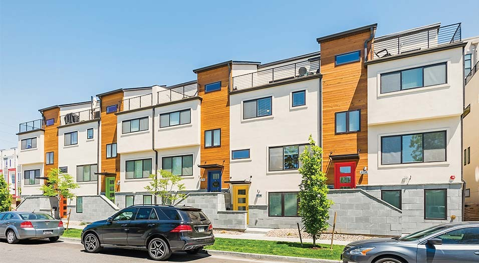
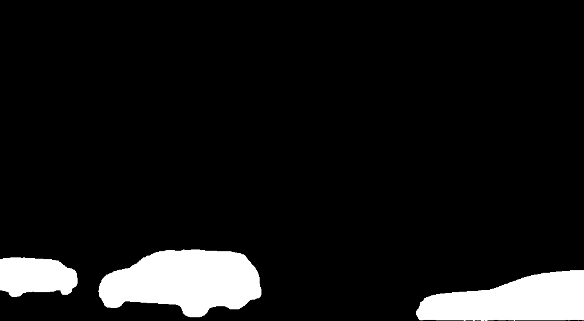
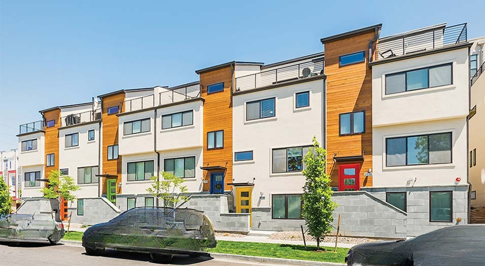

# Object Removal Pipeline using SAM + LaMa

This project integrates **Segment Anything Model (SAM)** by Meta and **LaMa (Look-at-the-mask)** by SAIC-AI to perform high-quality object removal in images. It allows users to semantically select and erase unwanted elements from images with visually realistic inpainting.

---

## Pipeline Overview

1. **SAM** segments the input image into 100+ object masks.
2. **User selects and combines** desired masks into a single binary mask.
3. **LaMa** uses this mask to remove unwanted regions and inpaint with context-aware reconstruction.

---

## SAM: Segment Anything Model

We use SAM to break down an image into many fine-grained mask segments.

**Original Image**  


**Example Segment Mask**  


> (You can optionally show a grid of all 100+ masks if you want)

---

## Combining Selected Masks

You can programmatically or visually choose 2–5 relevant masks and merge them:

```python
# combine_selected_masks.py
selected_files = ["0.png", "2.png", "3.png"]
```

**Combined Binary Mask**  


> White regions indicate the area to be removed.

---

## Object Removal with LaMa

A custom Python script runs the full LaMa pipeline:

- Resizes the image and mask
- Runs LaMa prediction
- Resizes the output to original resolution

```bash
python3 lama_pipeline.py
```

**Final Inpainted Output**  


---

## Setup Instructions

<details>
<summary><strong>🔧 Environment</strong></summary>

- Python 3.8+
- OpenCV (`cv2`)
- NumPy
- PyTorch 1.10+
- `segment-anything` (Meta AI repo)
- `LaMa` (patched for custom use)

</details>

### Install SAM

```bash
git clone https://github.com/facebookresearch/segment-anything.git
cd segment-anything
pip install -e .
```

### Install LaMa

```bash
git clone https://github.com/advimman/lama.git
cd lama
conda create -n lama python=3.10
conda activate lama
pip install -r requirements.txt
```

---

## Use Cases

- Real Estate: Remove clutter or furniture
- E-commerce: Product isolation
- Research: Dataset creation with masked content
- Creative tools for designers and artists
